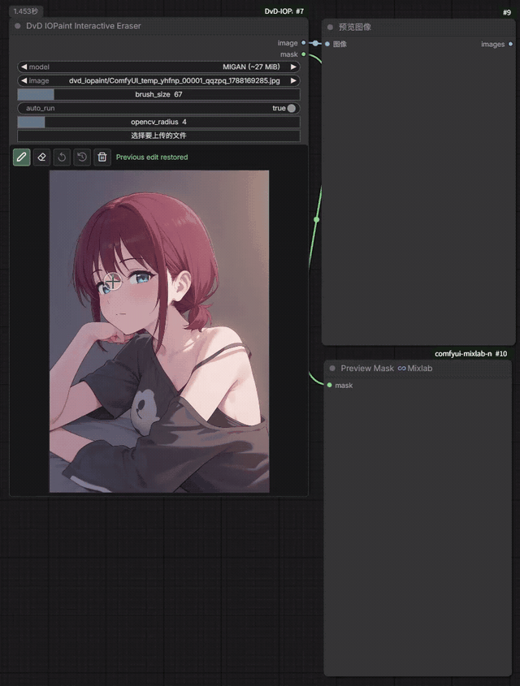
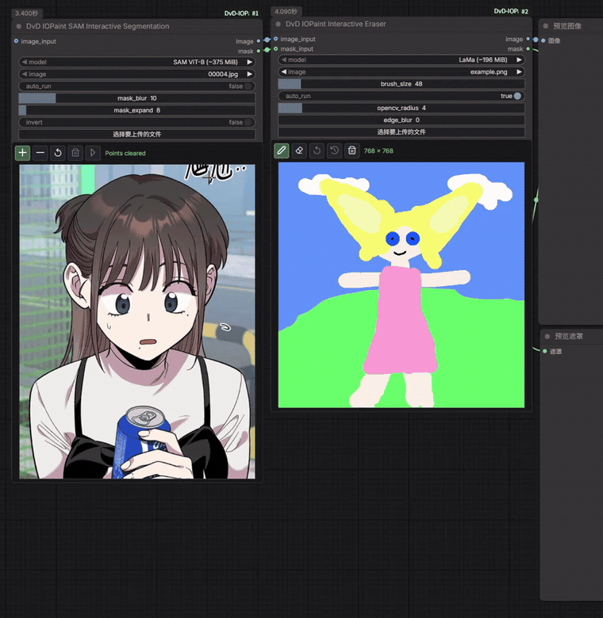
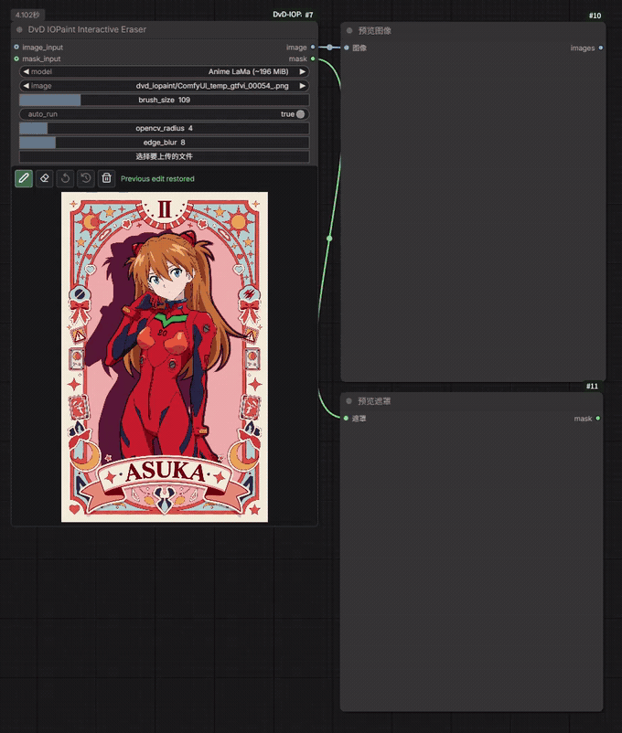
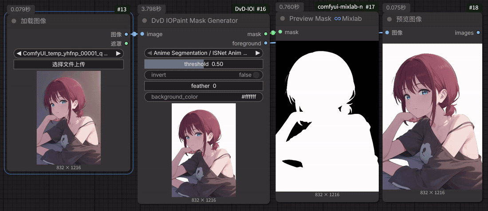

# ComfyUI-DvD-IOPaint

[English](README.md) · 简体中文 · [更新日志](CHANGELOG.md)

一个适用于 ComfyUI 的交互式图像消除节点，模型运行时改编自
[IOPaint](https://github.com/Sanster/IOPaint)。

在一个节点内完成图片载入、遮罩涂抹、自动消除、前后对比和连续编辑。

## 演示

### 交互式消除



### SAM 点击生成遮罩



### 外部遮罩接入消除节点



### 自动生成遮罩



## 功能

- 直接在节点画布上涂抹要消除的区域。
- 开启 `auto_run` 后，松开鼠标会自动提交遮罩并运行工作流。
- 处理结果会覆盖画布底图，可以继续进行下一次编辑。
- 将本地图片拖到节点上即可替换当前图片。
- 鼠标位于画布时显示半透明的画笔直径；按住 `Alt` 滚动滚轮可以调节画笔大小。
- 不按 `Alt` 时保留 ComfyUI 原本的节点画布缩放操作。
- 可以撤销尚未处理的遮罩笔画，也可以恢复上一次已经完成的消除结果。
- 在下方对比区移动或拖动鼠标，可以查看处理前后的分界效果。
- 新增 **DvD IOPaint Mask Generator**，可用 RemoveBG 或动漫专用 ISNet
  自动生成前景遮罩，并连接到消除节点。
- 新增 **DvD IOPaint SAM Interactive Segmentation**：直接点击节点里的物体生成
  可复用遮罩；左键添加前景点，右键添加背景点。
- 消除节点支持可选的 `IMAGE` 和 `MASK` 接入口；接入外部图像或遮罩后仍可用
  原来的节点处理流程，画笔遮罩会和外部遮罩合并。
- 模型只在第一次选用时下载，并进行 MD5 校验。
- 消除模型和遮罩模型按功能分目录保存到 `ComfyUI/models/iopaint`。
- 不需要安装完整 IOPaint，也不会替换 ComfyUI 自带的 Torch/CUDA 环境。

## 安装

### ComfyUI Manager

选择 **Install via Git URL**，填入：

```text
https://github.com/idvdii/ComfyUI-DvD-IOPaint.git
```

安装完成后重启 ComfyUI。

### 手动安装

```bash
cd ComfyUI/custom_nodes
git clone https://github.com/idvdii/ComfyUI-DvD-IOPaint.git
cd ComfyUI-DvD-IOPaint
python -m pip install -r requirements.txt
# 使用 Mask Generator 时再安装可选依赖
python -m pip install -r requirements-mask.txt
```

请使用 ComfyUI 对应的 Python。Windows 便携版通常会在 `ComfyUI` 同级目录
提供内置 Python 可执行文件。

如果只使用原来的消除节点，可以不安装 `requirements-mask.txt`。Mask Generator
第一次执行前需要 `rembg`；它会在运行时按所选模型自动下载 ONNX 权重，不会自动
修改 ComfyUI 的 Torch/CUDA 安装。

## 使用方法

1. 在 `DvD/Image` 分类下添加 **DvD IOPaint Interactive Eraser**。
2. 选择图片，或直接将本地图片拖到节点上。
3. 选择模型，涂抹要消除的物体或文字。
4. 松开鼠标。开启 `auto_run` 时会自动排队运行，结果会成为下一次编辑的底图。

工具栏按钮：

| 按钮 | 作用 |
| --- | --- |
| 铅笔 | 绘制消除遮罩 |
| 橡皮 | 擦除遮罩的一部分 |
| 撤销 | 撤销最近一次尚未处理的遮罩笔画 |
| 历史 | 恢复上一次消除前的图片 |
| 垃圾桶 | 清空当前遮罩 |

节点输出处理后的 `IMAGE` 和本次提交的 `MASK`。

`edge_blur` 用来柔化修复区域与原图的交界，默认 `0` 表示不处理。直接在单个消除
节点上手绘时可先尝试 `2–6`；数值过大会让边缘显得模糊。接入 `mask_input` 后，
大于 `0` 的 `edge_blur` 会作用于手绘遮罩和外部遮罩合并后的整体边缘；保持 `0`
则不会修改外部遮罩。`opencv_radius` 只对两个 OpenCV 模型有效，其他模型会忽略它。

### SAM 交互式遮罩

1. 添加 **DvD IOPaint SAM Interactive Segmentation**，连接一个 `IMAGE`，也可在
   节点的图片选项中选择文件。
2. 选择 SAM ViT 模型。左键点击要选择的物体；如果包含了不需要的区域，在该区域
   右键添加背景点。
3. `auto_run` 默认关闭，便于先添加多个点，再按播放按钮提交；开启后每次点击都会刷新遮罩。
4. 上方 `image` 输出是未经修改的源图；将下方 `mask` 输出连接到消除节点的
   `mask_input`。

`mask_expand` 以像素为单位向外扩展最终遮罩，`0` 表示保持原边界；
`mask_blur` 用于柔化遮罩边缘。

SAM1 根据点击位置和图像边界选择物体，不理解文字类别。复杂背景、相似物体或遮挡
场景可以补充多个前景点和背景点来改善结果。

### 自动生成遮罩

1. 在 `DvD/Image` 下添加 **DvD IOPaint Mask Generator**，接入一个 `IMAGE`。
2. 选择 Anime Segmentation 或 RemoveBG 模型。首次使用时才会下载对应权重。
3. 将 `mask` 输出连接到 **DvD IOPaint Interactive Eraser** 的 `mask_input`。
4. 如果要抠出背景而不是前景，打开 `invert`；`feather` 可以让遮罩边缘更柔和。

Mask Generator 同时输出 `foreground` 预览，默认背景为黑色。可在
`background_color` 中输入 `#RRGGBB`、`#RGB`、常见颜色名或 `R,G,B`，自定义
抠图预览/输出的纯色背景。该输出是三通道 IMAGE，不包含透明 Alpha；透明合成时
请继续使用 `mask` 作为 Alpha 遮罩。

## 模型

文件大小为约数，方便估算磁盘和网络占用。

| 模型 | 下载大小 | 模型文件 | 目录 | 说明 |
| --- | ---: | --- | --- | --- |
| LaMa | 约 196 MiB | [big-lama.pt](https://github.com/Sanster/models/releases/download/add_big_lama/big-lama.pt) | `erase` | 通用大遮罩消除 |
| Anime LaMa | 约 196 MiB | [anime-manga-big-lama.pt](https://github.com/Sanster/models/releases/download/AnimeMangaInpainting/anime-manga-big-lama.pt) | `erase` | 面向动漫和漫画的 LaMa 权重 |
| AOT Manga/Anime | 约 22 MiB | [aot_traced.pt](https://huggingface.co/ogkalu/aot-inpainting/resolve/42ffc84ff1bd46dd95f1c5a41e83ee7e98f39189/aot_traced.pt) | `erase` | 轻量彩色动漫/漫画选项 |
| MAT | 约 239 MiB | [Places_512_FullData_G.pth](https://github.com/Sanster/models/releases/download/add_mat/Places_512_FullData_G.pth) | `erase` | 注重结构的通用修复 |
| MIGAN | 约 27 MiB | [migan_traced.pt](https://github.com/Sanster/models/releases/download/migan/migan_traced.pt) | `erase` | 轻量级 512 尺寸修复 |
| LDM | 约 1.6 GiB，3 个文件 | [编码](https://github.com/Sanster/models/releases/download/add_ldm/cond_stage_model_encode.pt) · [解码](https://github.com/Sanster/models/releases/download/add_ldm/cond_stage_model_decode.pt) · [扩散](https://github.com/Sanster/models/releases/download/add_ldm/diffusion.pt) | `erase` | 基于扩散的消除模型，速度较慢且占用较大 |
| ZITS | 约 600 MiB，4 个文件 | [修复](https://github.com/Sanster/models/releases/download/add_zits/zits-inpaint-0717.pt) · [边缘线稿](https://github.com/Sanster/models/releases/download/add_zits/zits-edge-line-0717.pt) · [结构](https://github.com/Sanster/models/releases/download/add_zits/zits-structure-upsample-0717.pt) · [线框](https://github.com/Sanster/models/releases/download/add_zits/zits-wireframe-0717.pt) | `erase` | 注重结构和线稿的修复 |
| FcF | 约 327 MiB | [places_512_G.pth](https://github.com/Sanster/models/releases/download/add_fcf/places_512_G.pth) | `erase` | 适合较大缺口的频域修复 |
| Manga B&W Semantic | 约 235 MiB，2 个文件 | [修复模型](https://github.com/Sanster/models/releases/download/manga/manga_inpaintor.jit) · [线稿模型](https://github.com/Sanster/models/releases/download/manga/erika.jit) | `erase` | 仅适合黑白漫画，遮罩区域输出为灰度 |
| OpenCV Telea | 0 MiB | 无需下载 | 不适用 | 适合小缺陷的快速传统修复 |
| OpenCV Navier-Stokes | 0 MiB | 无需下载 | 不适用 | 适合小缺陷的快速传统修复 |

Mask Generator 当前支持的模型：

| 模型 | 下载大小（约） | 模型文件 | 目录 |
| --- | ---: | --- | --- |
| Anime Segmentation / ISNet Anime | 170 MiB | [isnet-anime.onnx](https://github.com/danielgatis/rembg/releases/download/v0.0.0/isnet-anime.onnx) | `mask/anime_seg` |
| RemoveBG / U2Net | 176 MiB | [u2net.onnx](https://github.com/danielgatis/rembg/releases/download/v0.0.0/u2net.onnx) | `mask/removebg` |
| RemoveBG / U2NetP | 4.7 MiB | [u2netp.onnx](https://github.com/danielgatis/rembg/releases/download/v0.0.0/u2netp.onnx) | `mask/removebg` |
| RemoveBG / ISNet General | 167 MiB | [isnet-general-use.onnx](https://github.com/danielgatis/rembg/releases/download/v0.0.0/isnet-general-use.onnx) | `mask/removebg` |
| RemoveBG / BiRefNet Lite | 90 MiB | [BiRefNet General Lite](https://github.com/danielgatis/rembg/releases/download/v0.0.0/BiRefNet-general-bb_swin_v1_tiny-epoch_232.onnx) | `mask/removebg` |
| RemoveBG / BiRefNet | 443 MiB | [BiRefNet General](https://github.com/danielgatis/rembg/releases/download/v0.0.0/BiRefNet-general-epoch_244.onnx) | `mask/removebg` |
| RemoveBG / Silueta | 44 MiB | [silueta.onnx](https://github.com/danielgatis/rembg/releases/download/v0.0.0/silueta.onnx) | `mask/removebg` |

SAM 交互式分割模型：

| 模型 | 下载大小（约） | 模型文件 | 目录 |
| --- | ---: | --- | --- |
| SAM ViT-B | 375 MiB | [sam_vit_b_01ec64.pth](https://dl.fbaipublicfiles.com/segment_anything/sam_vit_b_01ec64.pth) | `interactive_seg` |
| SAM ViT-L | 1.25 GiB | [sam_vit_l_0b3195.pth](https://dl.fbaipublicfiles.com/segment_anything/sam_vit_l_0b3195.pth) | `interactive_seg` |
| SAM ViT-H | 2.56 GiB | [sam_vit_h_4b8939.pth](https://dl.fbaipublicfiles.com/segment_anything/sam_vit_h_4b8939.pth) | `interactive_seg` |

神经网络模型首次使用时需要访问对应的 GitHub 或 Hugging Face 下载地址。
下载中断或校验失败的文件会被删除，下次运行时自动重新下载。

推荐让节点自动下载。如果需要手动下载，请保持表格所列文件名不变，并放入
`ComfyUI/models/iopaint` 下表格指定的目录；多文件模型需要下载该行的全部文件。

模型目录结构如下：

```text
ComfyUI/models/iopaint/
├─ erase/                 # LaMa、AOT、MAT、MIGAN 等消除模型
├─ mask/
   ├─ anime_seg/          # Anime Segmentation / ISNet Anime
   └─ removebg/           # rembg 的 U2Net、ISNet、BiRefNet 等模型
└─ interactive_seg/       # SAM1 权重（第一次点击后下载）
```

旧版本如果把消除模型放在 `models/iopaint` 根目录，节点会在首次检查时只迁移
自己识别且校验正确的文件到 `erase`，不会处理其他文件。

## 依赖与兼容性

`requirements.txt` 只包含本节点额外需要的包：

- `opencv-contrib-python-headless`：图像处理和 OpenCV 传统修复
- `scikit-image`：ZITS 的边缘和线稿处理

Mask Generator 的可选依赖写在 `requirements-mask.txt`：

- `rembg`：RemoveBG 和 ISNet Anime 的 ONNX 推理与首次下载。

SAM 交互式分割不需要额外安装依赖：节点包内置轻量的 SAM1 Python 运行代码，只复用
ComfyUI 已有的 Torch 和 NumPy，不安装 SAM 包、CUDA Toolkit，也不会替换 Torch。
第一次添加点击点时才下载所选权重，并保存到 `models/iopaint/interactive_seg`。

该文件没有锁定 `torch`、`torchvision` 或 CUDA。默认 rembg 依赖 CPU ONNX
Runtime；如果你已经使用 GPU ONNX Runtime，请保留与本机匹配的版本，并检查
安装输出，避免被 pip 替换。

Torch、NumPy、Pillow、Pydantic、SciPy 和 tqdm 由 ComfyUI 提供，因此这里不会
锁定版本。这样可以避免覆盖用户针对显卡配置的 Torch 环境。节点只携带隔离的
IOPaint 消除模型运行时，不会安装完整 IOPaint 应用。

已在 ComfyUI `v0.30.2`、Python 3.13、PyTorch 2.9.1 和 CUDA 环境测试。CPU
也可以运行，但速度较慢。可在 ComfyUI 目录执行冒烟测试：

```bash
python custom_nodes/ComfyUI-DvD-IOPaint/tests/test_smoke.py
```

## 致谢与许可证

消除模型的下载地址、校验值、预处理逻辑和运行时源码改编自 IOPaint 1.6.0。
具体上游提交和改动说明请参见 [NOTICE](NOTICE)。感谢 IOPaint 社区提供开源的
图像修复实现和模型整合工作。

本项目遵循 [Apache License 2.0](LICENSE)。
